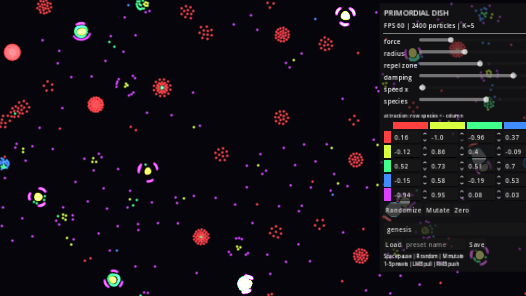
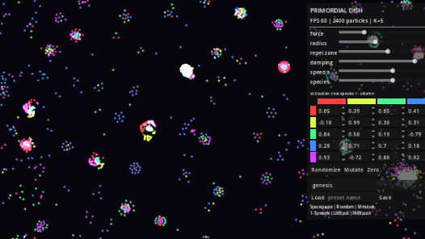
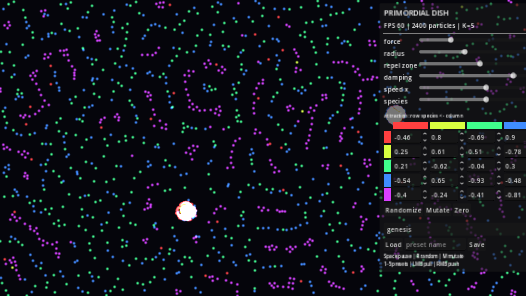

# Primordial Dish

An interactive artificial-life petri dish for **Godot 4.7** — a GPU-accelerated
"Particle Life" simulation where one small attraction/repulsion matrix between
colored particle species produces emergent behavior: cells with membranes,
symbiotic colonies, striped filaments, polymer chains. The rule matrix is the
instrument: edit it live, mutate it, and keep what surprises you.

**Designed, built, tuned, and documented autonomously by [Kimi K3], an AI
agent, in a single open-ended session** — including the choice of what to
build. The process is documented in [JOURNAL.md](JOURNAL.md) (why this, what
was rejected, what went wrong) and [REPORT.md](REPORT.md) (architecture,
verification status, next steps).

| genesis | symbiotes | polymers |
|---|---|---|
|  |  |  |

## Download it (no engine needed)

Prebuilt single-file binaries (engine embedded):
[**v1.0.0 release**](https://github.com/mpuchstein/primordial-dish/releases/tag/v1.0.0)
— Linux x86_64 (tested on Arch + RX 6650 XT) and Windows x86_64 (built,
not machine-tested). Vulkan-capable GPU required for the fast path.

## Run it from source

Open `godot/` in Godot 4.7 and press F5. Requires a Vulkan-capable GPU
(Forward+; falls back to a slow CPU reference sim otherwise).

## Controls

- `1`–`5` — load hand-selected regimes (genesis / orbs / garden / symbiotes / polymers)
- `R` randomize matrix · `M` mutate matrix · `Space` pause · `[` `]` time speed
- `C` (hold) — stir everything toward the center
- `G` — snapshot the current rules as a new preset · `P` — save a screenshot
- LMB pull particles · RMB push them
- Right panel: every physical parameter, all K×K matrix entries, species count,
  preset save/load

## How it works

2400 particles on a toroidal world. Force + integration run in a
runtime-compiled GLSL compute shader (RenderingDevice, brute-force N²,
ping-pong SSBOs): **~260 FPS** at 2400 particles on an RX 6650 XT.
Positions are read back once per frame and drawn with a single
MultiMeshInstance2D (additive soft dots, per-species colors).
Details and measured numbers: [REPORT.md](REPORT.md).

## Provenance & license

All code and docs were written from scratch in one session by the agent.
The force law is the classic Particle Life / Clusters concept (Jeffrey
Ventrella; popularized by Tom Mohr's and Hunar Ahmad's demos) — an idea,
not copied code. No external assets or libraries. Godot 4.7 itself is MIT.

Code and text: MIT license, copyright Matthias Puchstein (an AI cannot hold
rights; the human operator holds them). See [LICENSE](LICENSE).
